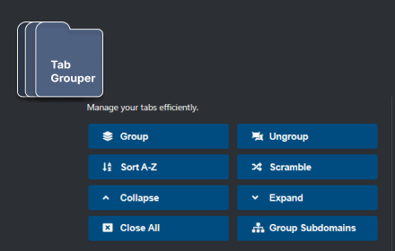

# Tab Grouper

Tab Grouper is a Microsoft Edge extension designed to enhance tab management.

## Features

- **Group Tabs**: Groups all the open tabs by their domain.
- **Ungroup Tabs**: Ungroups all the grouped tabs.
- **Sort Tabs**: Sorts all non-grouped tabs alphabetically by their title.
- **Group by Subdomain**: Groups tabs by subdomain.
- **Scramble Tabs** (Developer Mode): Randomizes the order of the tabs.
- **Collapse Groups**: Collapses all tab groups. (Access via extension popup)
- **Expand Groups**: Expands all tab groups. (Access via extension popup)
- **Close All Tabs**: Closes all tabs. (Access via extension popup)

These features can be accessed from the extension popup or context menu that appears on right-click within any webpage. Keyboard shortcuts are also available for quicker access to some of these features.

## Usage

After installing the extension, you can access its functionalities by either:

1. Clicking on the extension icon in the toolbar and using the popup UI.
2. Right-clicking on any webpage to bring up the context menu and selecting the desired option.
3. Using the keyboard shortcuts for selected features:
    - Group Tabs: Alt+Shift+M
    - Ungroup Tabs: Alt+Shift+J
    - Sort Tabs: Alt+Shift+H
    - Group by Subdomain: Alt+Shift+P

## Installation

For installation, simply [click here](https://microsoftedge.microsoft.com/addons/detail/tab-grouper/cjamddajnhimgjogcgighnbaojgliccc) or head over to the Microsoft Edge extensions store, search for "Tab Grouper," and install it. Once installed, the extension will appear in your toolbar.

## Development

The extension is developed using standard web technologies: HTML, CSS, and JavaScript. It's structured into a manifest file, a background script (`tabGrouper.js`), an extension popup (`popup.html` and `popup.js`), and asset files.

If you wish to contribute, kindly fork the repository, make your changes, and submit a pull request.

## Upcoming Features
- [ ] Exclude groups from being affected
- [ ] Exclude tabs from being grouped
- [ ] Options for default group state after (collapsed, expanded)
- [x] Sub-domain grouping
- [ ] Display inactive tabs
- [ ] Organize collections (open & group collections)
- [ ] UI updates
- [ ] New logo

## Feedback & Support

For any bugs or feature suggestions, please open an issue on GitHub. If you find this extension useful and wish to support the development, consider visiting the cashapp link found in the extension popup.

## License

MIT